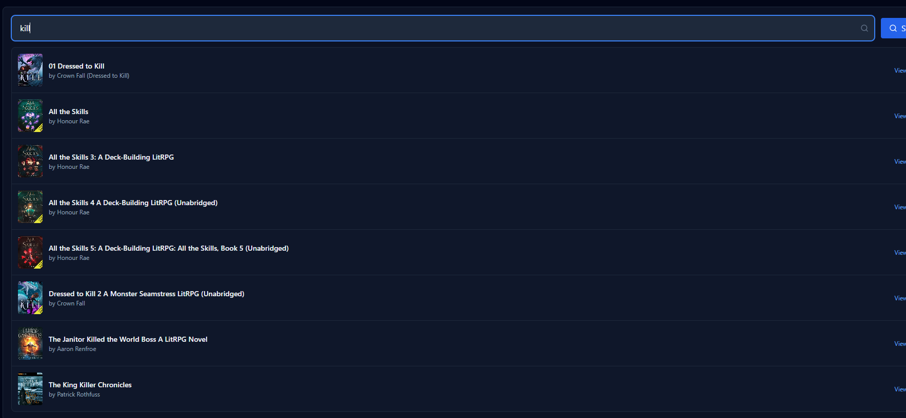
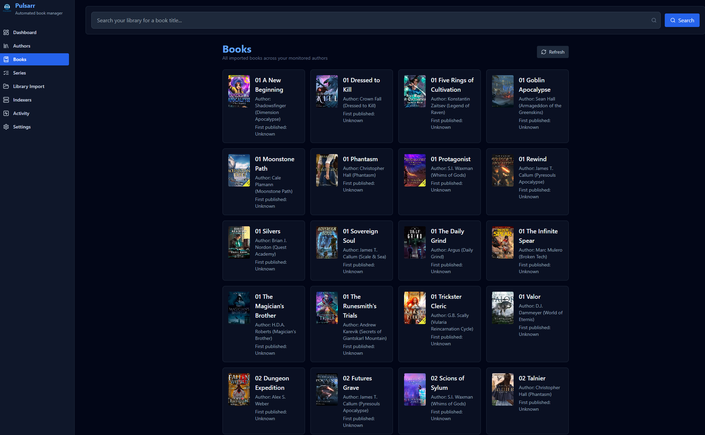
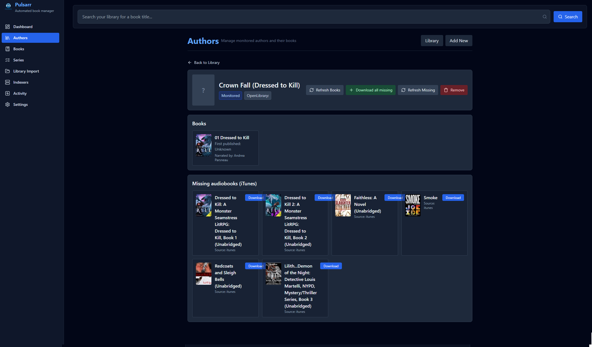
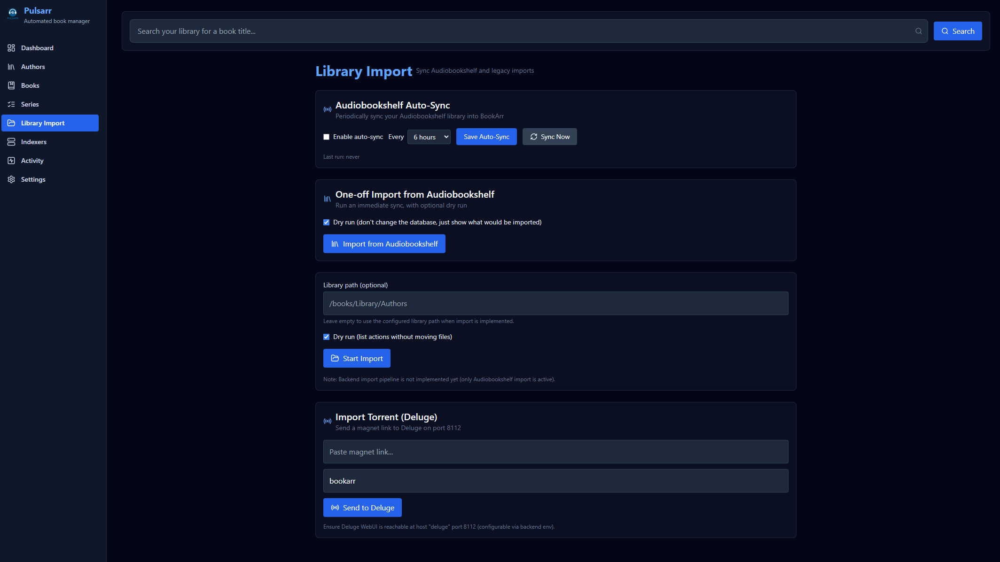

Pulsarr is a lightweight automation service designed for **Audiobookshelf**. It connects directly to the Audiobookshelf API to sync your library, accept audiobook requests, send magnet links to Deluge with appropriate labeling, and automatically import completed downloads back into your Audiobookshelf library. Fully Dockerized, fully automated, and hands-free.

## Features

✔ **Direct Audiobookshelf API Integration** 

✔ **Automatic Library Syncing** 

✔ **Request Audiobooks → Send Magnet Links to Deluge** 

✔ **Applies the Correct Deluge Label Automatically** 

✔ **Moves Finished Downloads Into Your Audiobookshelf Library**

✔ **Fully Dockerized Deployment**

## Update

Prowlarr support has been fixed and is working correctly — just in time for the realization that public torrent sites rarely host audiobooks.

## The New Plan

* I now have a better understanding of how magnet links work.
* The audiobook sources I currently use already provide all required magnet information, and they don’t require authentication.
* **Pulsarr will use these sources by default.**
* If you also have a semi-private torrent indexer with strong audiobook support, you can still use Prowlarr for enhanced results.

